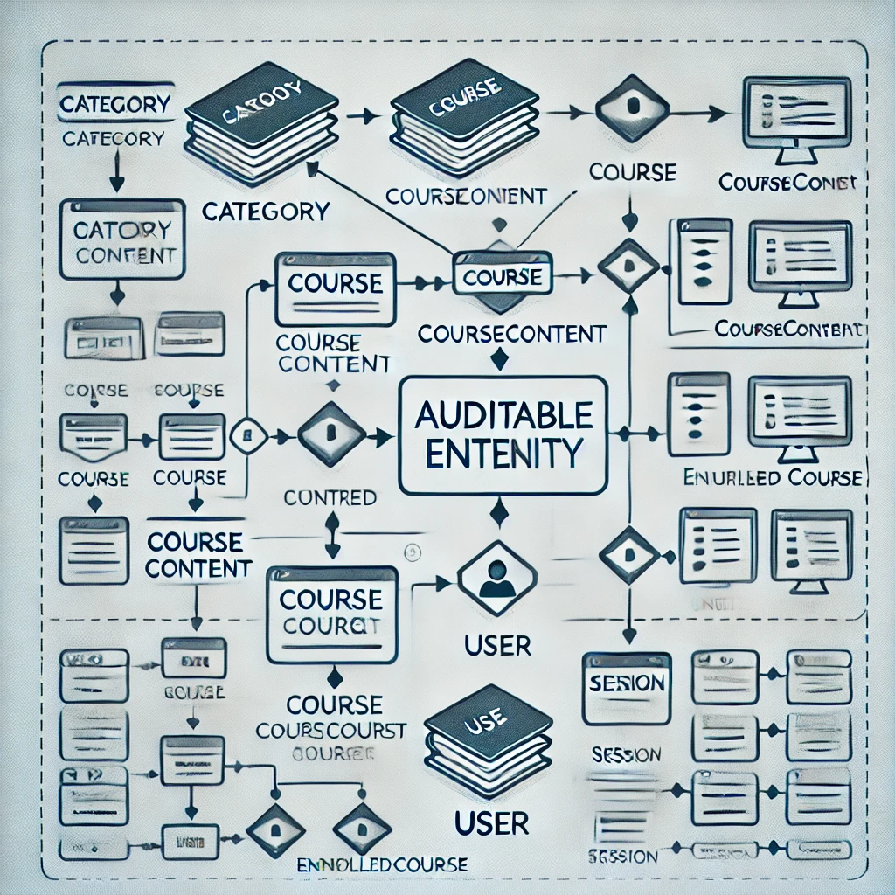

# LMS-Springboot

Here is a detailed `README.md` for your Spring Boot LMS application:

---

# LMS Application

This project is a comprehensive Learning Management System (LMS) built using Spring Boot. It includes features for user authentication, course creation, enrollment, role-based access control, and more. The system is designed to manage online courses, allowing users to sign up, log in, view and purchase courses, and access course content based on their enrollment status.

## Features

- **User Authentication**: Secure login and signup functionality using JWT and OAuth2.
- **Role-Based Access Control**: Different roles such as `USER`, `ADMIN`, and `CREATOR` have different permissions.
- **Course Management**: Create, update, delete, and view courses, along with categorization.
- **Course Enrollment**: Users can enroll in courses and access content based on enrollment.
- **Secure Session Management**: Secure handling of cookies for refresh tokens.
- **OAuth2 Integration**: Supports OAuth2 login for easy access.

## Technology Stack

- **Backend**: Spring Boot, Spring Security, JWT, OAuth2
- **Database**: PostgreSQL (via JPA/Hibernate)
- **Build Tool**: Maven
- **Authentication**: JWT Tokens and Cookies for session management

## Setup Instructions

1. Clone the repository:
   ```bash
   git clone <repository-url>
   ```
2. Navigate to the project directory:
   ```bash
   cd LMS-Application
   ```
3. Update the `application.properties` file with your PostgreSQL database credentials and other necessary configuration.
4. Run the application:
   ```bash
   ./mvnw spring-boot:run
   ```

## Configuration

In the `application.properties`, make sure to set the environment for cookie security:
```properties
deploy.env=development
# or
deploy.env=production
```

## Endpoints

### Authentication

- **POST** `/auth/signup` - Register a new user
- **POST** `/auth/login` - Login to the system
- **POST** `/auth/refresh` - Refresh JWT using refresh token
- **DELETE** `/auth/logout` - Logout from the system

### Category Management

- **POST** `/api/category/CreateCategory` - Create a new category (Admin & Creator)
- **GET** `/api/category/allCategory` - Get all categories

### Course Management

- **POST** `/api/course/CreateCourse/{categoryId}` - Create a new course under a category (Admin & Creator)
- **GET** `/api/course/getCourseByCategoryId/{categoryId}` - Get courses by category ID
- **GET** `/api/course/allCourse` - Get all courses
- **DELETE** `/api/course/delCourseById/{courseId}` - Delete a course by ID (Admin)
- **GET** `/api/course/allCourse/author` - Get courses created by the logged-in author
- **DELETE** `/api/course/delCourseByAuthor/{courseId}` - Delete a course by author (Author can delete their own courses)

### Course Content Management

- **POST** `/api/createCourseContent/{courseId}` - Create course content for a specific course
- **GET** `/api/courseContent/{courseId}` - Get content for a specific course (Accessible by enrolled users)

### Enrollment

- **GET** `/api/enrolled` - Get enrolled courses for the current user
- **POST** `/api/enrolled/enroll/{courseId}` - Enroll in a specific course (Authenticated users)
- **GET** `/api/enrolled/course-content/{courseId}` - Get content for enrolled courses
- **GET** `/api/enrolled/courses` - Get a list of all enrolled courses (Admin)
- **GET** `/api/enrolled/users-enrolled/{courseId}` - Get users enrolled in a specific course (Admin & Creator)
- **GET** `/api/enrolled/status` - Get status (enrolled, completed) of courses for the current user

### User Management

- **GET** `/users` - Get all users (Admin only)

### Security

Security is managed using Spring Security, JWT, and OAuth2. The application uses role-based access control, ensuring that only authorized users can access certain features.

**Public Routes**:
- `/auth/**`, `/api/allCategory`, `/error`, `/home.html`, `/session/**`

**Secured Routes**:
- Accessible based on roles (`USER`, `ADMIN`, `CREATOR`) and permissions

## Security Configuration

- **JWT Authentication**: The `JwtAuthFilter` handles JWT token validation.
- **OAuth2 Login**: Supported for seamless login with external providers.
- **Session Management**: Configured for stateless session using JWT, with cookies handling refresh tokens securely.


#DETAILED DESCRIPTION

# Learning Management System (LMS) Application

This project is a full-fledged Learning Management System (LMS) built using Spring Boot, designed to provide features for user authentication, course management, and secure access control. The system uses a robust auditing mechanism to track changes and actions within the application.

## Features

- **User Authentication & Authorization**: Secure login and signup using JWT-based authentication and OAuth2. Role-based access control allows different levels of access for Admin, Instructor, and Students.
- **Auditing**: The application tracks the actions performed (created, updated, deleted) by users to maintain accountability and transparency.
- **Course Management**: Admins and instructors can create, manage, and categorize courses. Courses can include multiple pieces of content.
- **Enrollment System**: Users can enroll in courses, and course access is determined based on purchase and enrollment status.
- **Database Integration**: The system uses PostgreSQL to store user, course, and session information.
- **Docker Support**: Easy setup and deployment using Docker Compose.

## Technologies Used

- **Java 21**
- **Spring Boot**
- **Spring Security**
- **JWT & OAuth2**
- **JPA & Hibernate**
- **PostgreSQL**
- **Docker & Docker Compose**
- **Lombok**
- **ModelMapper** (for DTO mapping)

## Getting Started

### Prerequisites

- Java 21
- Maven
- Docker & Docker Compose

### Installation

1. Clone the repository:
   ```bash
   git clone https://github.com/username/lms-application.git
   ```
2. Navigate to the project directory:
   ```bash
   cd lms-application
   ```
3. Build the project:
   ```bash
   mvn clean install
   ```
4. Start the application using Docker Compose:
   ```bash
   docker-compose up -d
   ```

### Configuration

Update `application.properties` for:
- Database configurations
- JWT secret keys
- OAuth2 Client credentials

## Entities and Relationships

### Auditing Mechanism

Auditing is implemented using `@EnableJpaAuditing` to track actions performed by users. The `AuditableEntity` base class includes common fields like `createdBy`, `createdDate`, `lastModifiedBy`, and `lastModifiedDate`. These fields are automatically populated based on the current authenticated user via the `AuditorAuth` class, which implements `AuditorAware`.

**Example Configuration for Auditing:**
```java
@Configuration
@EnableJpaAuditing(auditorAwareRef = "auditorAware")
public class AppConfig {
    @Bean
    ModelMapper getMapper() {
        return new ModelMapper();
    }

    @Bean
    AuditorAware<String> auditorAware() {
        return new AuditorAuth();
    }
}
```

### Entity Classes

- **Category**
    - Represents a course category (e.g., Technology, Arts).
    - Has a one-to-many relationship with `Course`.
- **Course**
    - Represents a single course.
    - Has a many-to-one relationship with `Category`.
    - Contains multiple `CourseContent` entities.
    - Can be associated with multiple `EnrolledCourse` records.
- **CourseContent**
    - Represents content within a course (e.g., videos, documents).
    - Belongs to a single `Course`.
- **Enrolled**
    - Represents the enrollment section for a user, similar to a cart.
    - Each user has one `Enrolled` entity, which can contain multiple `EnrolledCourse` records.
- **EnrolledCourse**
    - Represents a specific course enrolled by a user.
    - Linked to both `Enrolled` and `Course`.
    - Tracks enrollment status using enums (`PENDING`, `APPROVED`, etc.).
- **User**
    - Core entity for authentication.
    - Can be assigned multiple roles (ADMIN, USER, INSTRUCTOR).
    - Linked to `Enrolled` and `Session` entities.
- **Session**
    - Tracks refresh tokens and manages user sessions.

### Entity Relationships Diagram



The entities and their relationships are represented in a diagram format below.

## API Endpoints

### Authentication

- **POST /auth/signup**
    - Allows new users to register.
    - Requires `email`, `password`, and `name`.

- **POST /auth/login**
    - Allows existing users to log in.
    - Returns JWT tokens on successful authentication.

- **POST /auth/refresh**
    - Refreshes the access token using a valid refresh token.

- **DELETE /auth/logout**
    - Logs out the user and invalidates the session.

### Course Management

- **POST /courses**
    - Creates a new course.
    - Requires `coursename`, `description`, and `categoryId`.

- **GET /courses**
    - Retrieves a list of all courses.
    - Supports filtering by category.

- **GET /courses/{id}**
    - Fetches details of a specific course by ID.

- **PUT /courses/{id}**
    - Updates an existing course.
    - Requires `id`, `coursename`, and `description`.

- **DELETE /courses/{id}**
    - Deletes a course by ID.

### Enrollment Management

- **POST /enroll**
    - Enrolls a user in a specific course.
    - Requires `courseId`.

- **GET /enrollments**
    - Retrieves the enrolled courses for the authenticated user.

### Category Management

- **POST /categories**
    - Creates a new category.
    - Requires `coursesCategory`.

- **GET /categories**
    - Retrieves all categories.

- **PUT /categories/{id}**
    - Updates an existing category.

- **DELETE /categories/{id}**
    - Deletes a category by ID.

## Conclusion

The LMS application is a robust solution for managing online courses. With features like auditing, role-based access, and Docker support, it provides a secure and scalable environment for learning management. Follow the setup instructions to get started, and refer to the API documentation for integration details.
```


This `README.md` provides a comprehensive overview of your LMS application, making it easy for new users to understand and get started with the project. Let me know if there are any additional details you'd like to include!